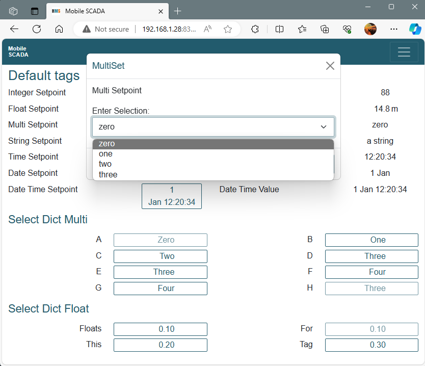
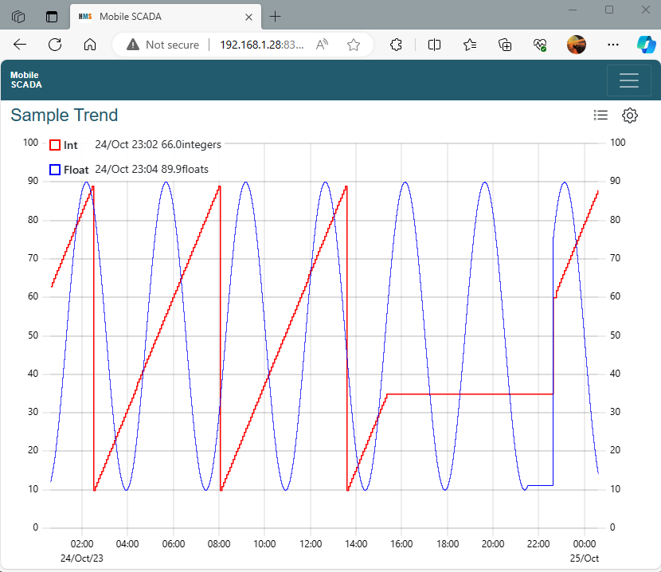

# pymscada
#### [Docs](./docs/README.md)
## Python Mobile SCADA

This is a small SCADA package that will run on Linux (preferably) or
Windows. The server runs as several modules on the host, sharing
information through a message bus. A __subset__ of modules is:

- Bus server - shares tag values with by exception updates
- Modbus client - reads and writes to a PLC using Modbus/TCP
- History - saves data changes, serves history to web pages
- Web server - serves web pages which connect with a web socket
- Web pages - an Angular single page web application

Web pages are responsive and defined procedurally from the
```wwwserver.yaml``` config file.



Trends use [uPlot](https://github.com/leeoniya/uPlot).



## Objectives

Traditional SCADA has a fixed 19:6, 1920x1080 or some equivalent layout.
It's great on a big screen but not good on a phone. Hence __Mobile__
SCADA with a responsive layout.

I wrote Mobile SCADA to provide a GUI to the other things I was trying to
do, I wanted to leverage web browsers and eliminate a dedicated
_viewer.exe_. Display on the client is fast, trends, as fast as I can
make them.

Uptimes should be excellent. The best I have on an earlier version is
over 5 years for about half of the script modules. This version is a
complete rewrite, however the aim is the same.

All tag value updates are by exception. So an update from you setting a
value to seeing the feedback should be __FAST__.

## Commercial Support

For basic SCADA functionality, ```pyscada``` costs nothing and should be
inexpensive to set up and run. ```Mobile SCADA``` is a commercial product
which is the source of most of the ```pymscada``` functionality.

If you want commercial support you can contact me through
[linkedin](https://www.linkedin.com/in/jamie-walton-47b82822/).

## More Details

See [docs](./docs/README.md) for more. These include:

- Install and getting the demo to run in [Windows](./docs/windows_demo.md)
- ... and in [Debian 12](./docs/debian_demo.md)
- Additional [Modules](./docs/module_list.md)
- The [Tag](./docs/tags.md) class
- A description of the [Modbus PLC](./docs/modbus_plc_demo.md) emulation demo
- Setting up a [development environment](./docs/debian_dev.md) on Debian
- Using Apache on Linux as a web facing [front end](./docs/apache.md)

# Licence

```pymscada``` is distributed under the GPLv3 [license](./LICENSE).
