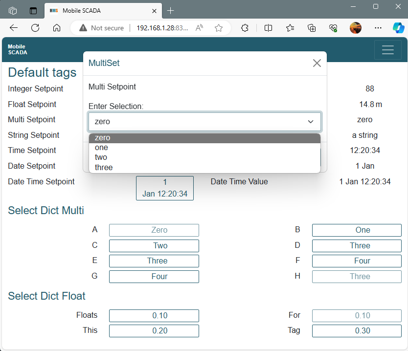
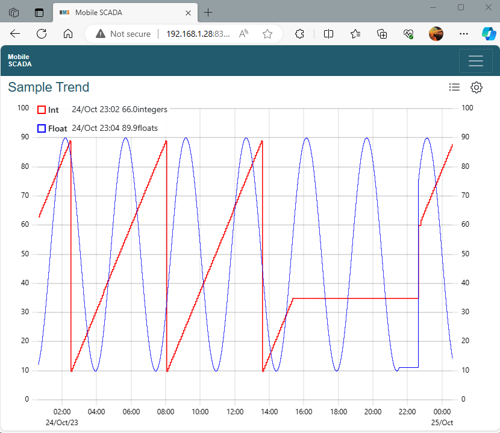

# pymscada
A simple bus and shared value SCADA system with an angular html client

See [docs](https://github.com/jamie0walton/pymscada/tree/main/docs) for more details
for dev environment and use with ```systemd``` in Debian.

# In Windows

Not my preference but perhaps simplest.

```shell
pip install pymscada
git clone https://github.com/jamie0walton/pymscada.git
```

In separate windows:
```shell
cd pymscada
pymscada run bus
pymscada run wwwserver --config .\docs\examples\wwwserver.yaml --tags .\docs\examples\tags.yaml
pymscada run simulate --config .\docs\examples\simulate.yaml --tags .\docs\examples\tags.yaml
pymscada run files --config .\docs\examples\files.yaml
pymscada run history --config .\docs\examples\history.yaml --tags .\docs\examples\tags.yaml
# Browse to http://localhost:8324
```

# Design Philosophy

Reads and writes to a PLC, presents you with a web page where you can see and set values.
Updates in every direction are by exception. Every communication is tag based and the tags
can be written and reacted to any where at any time.

If you update a value every scan Mobile SCADA will mostly work, however it will eventually
act in many broken ways as your coding approach increasingly conflicts with the design
philosophy.

Be comfortable using ```asyncio```, ```await``` and ```async```. Set tags with
```<tagname>.value = <something typed>```. React by exception with
```<tagname>.add_callback(<function>)```. In function expect a ```Tag``` argument.
Never set the tag value in the tag callback as the Tag class will complain and it will
not work.

Loops where tag1 updates tag2 updating tag1 will consume a lot of CPU for very little
productive output. Avoid these.

I generally try to assume that at any point in the code the input from other parts of the
code is right. This is mostly successful. I'm working to find and fix and ```pytest``` any
cases where this is not right.

# The Example
Look [here](https://github.com/jamie0walton/pymscada/tree/main/docs/examples) to see the
configuration used for these files.



